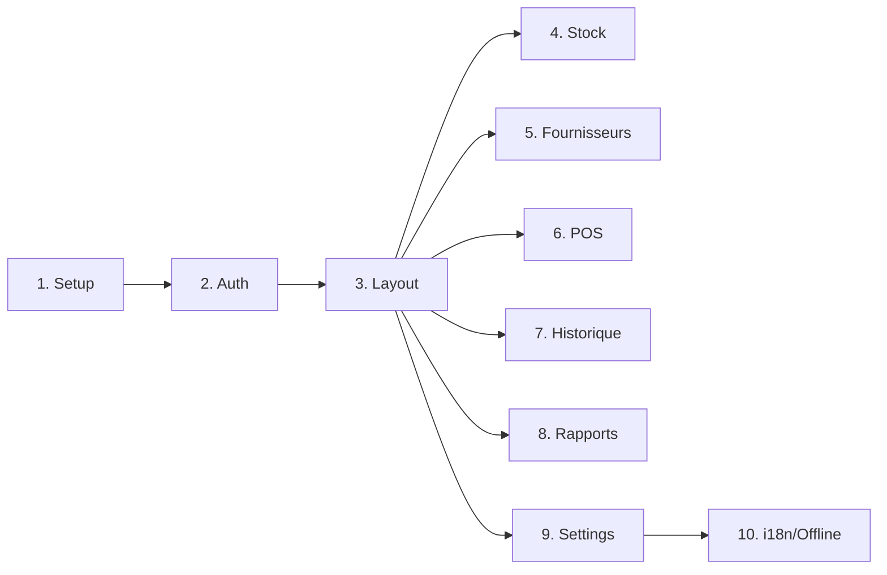

# 📋 RÉSUMÉ RAPIDE - Frontend Pharmac+

## � Design de Référence


---

## 🎯 Palette de Couleurs Extraite

| Élément | Couleur | Code Hex |
|---------|---------|----------|
| Sidebar | Bleu nuit | `#1a1f37` |
| Accent primaire | Bleu | `#2d9cdb` |
| Accent succès | Vert | `#10b981` |
| Fond principal | Gris clair | `#f3f4f6` |
| Cards | Blanc | `#ffffff` |
| Texte primaire | Gris foncé | `#1f2937` |

---

## � Livrables Créés

| Fichier | Description |
|---------|-------------|
| [GUIDE_PROMPTS_DETAILLES.md](file:///c:/Pharma_logiciels_version_01/frontend/GUIDE_PROMPTS_DETAILLES.md) | 10 prompts copy-paste avec design exact |
| [implementation_plan.md](file:///C:/Users/ARNAUD/.gemini/antigravity/brain/52ddd6a6-4e32-4884-8a36-d0af2de0b3da/implementation_plan.md) | Architecture technique |

---

## 🚀 Quick Start

### 1. Lancer le Backend
```bash
cd backend
venv\Scripts\activate
uvicorn main:app --reload
```

### 2. Exécuter les Prompts
1. Ouvrez `GUIDE_PROMPTS_DETAILLES.md`
2. Copiez **Prompt 1** (Setup)
3. Testez le résultat
4. Continuez avec les prompts suivants

---

## 📊 10 Modules à Créer



---

## ✨ Caractéristiques Clés

- ✅ **Dark/Light Mode** avec toggle dans le Header
- ✅ **Design Pharmac+** : Sidebar bleu nuit, cards blanches
- ✅ **KPI Cards** avec icônes rondes colorées
- ✅ **Tableaux** style moderne avec actions
- ✅ **POS** : Interface vente à 2 colonnes
- ✅ **Rapports** : Export Excel/PDF
- ✅ **Multilingue** : FR/EN
